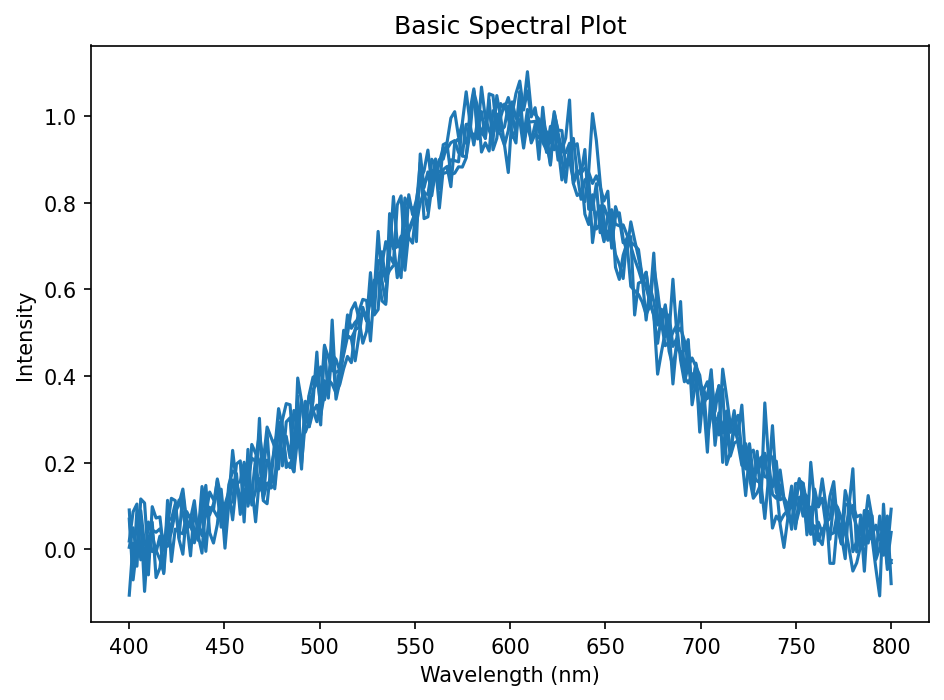
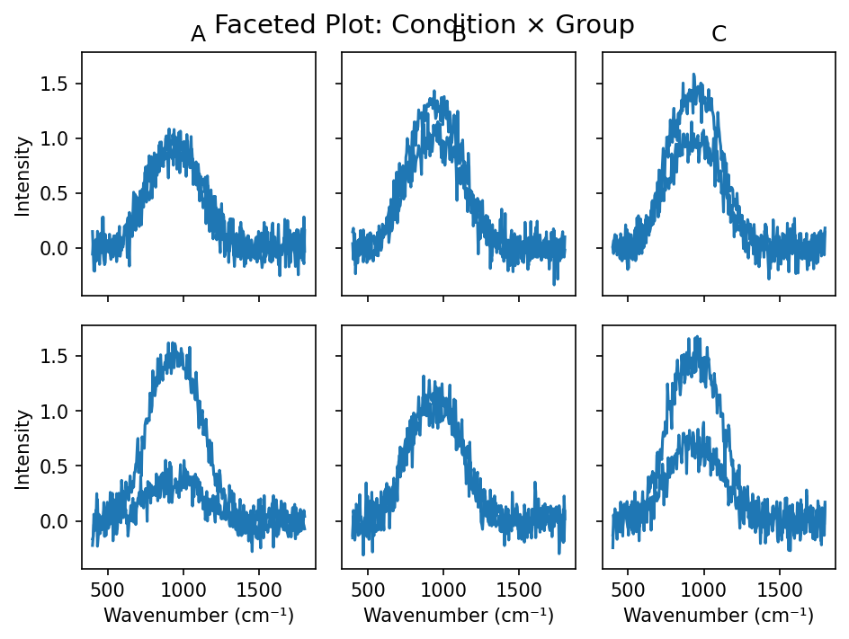
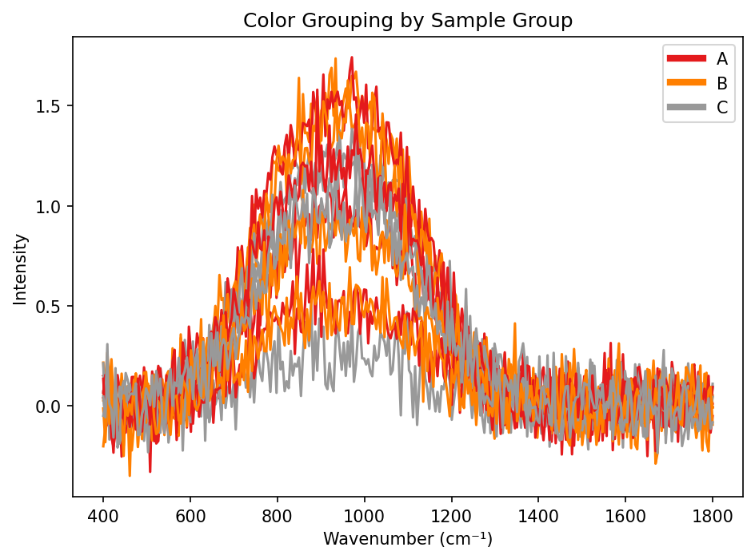
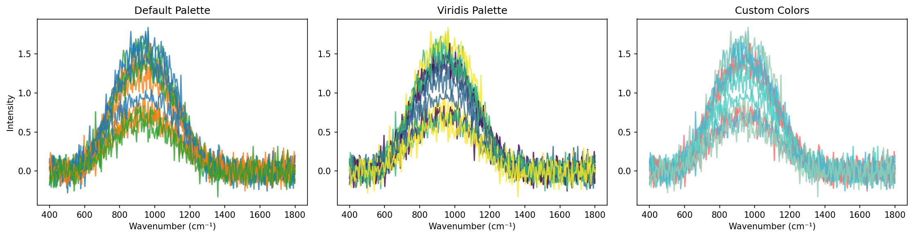
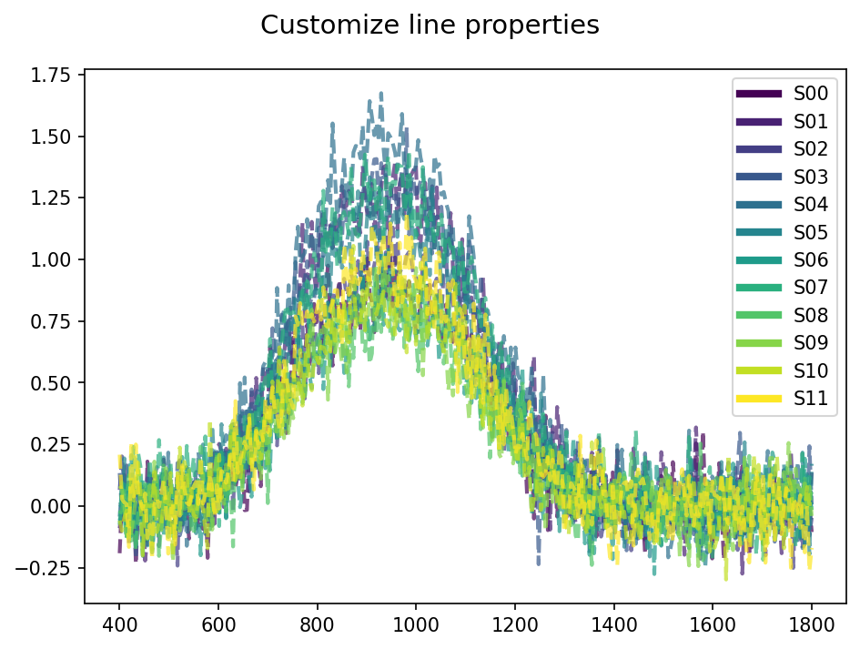
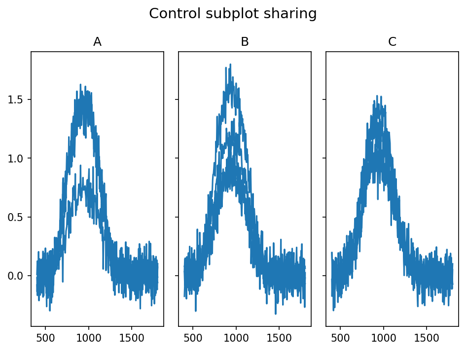
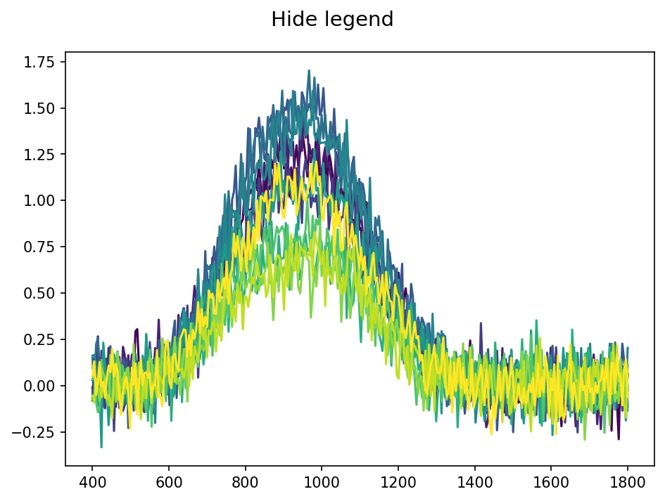
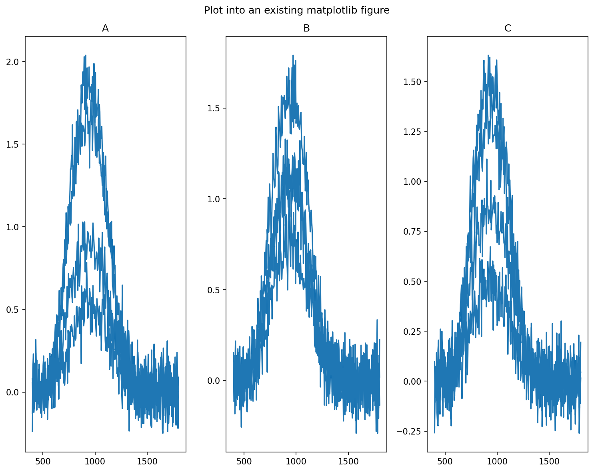
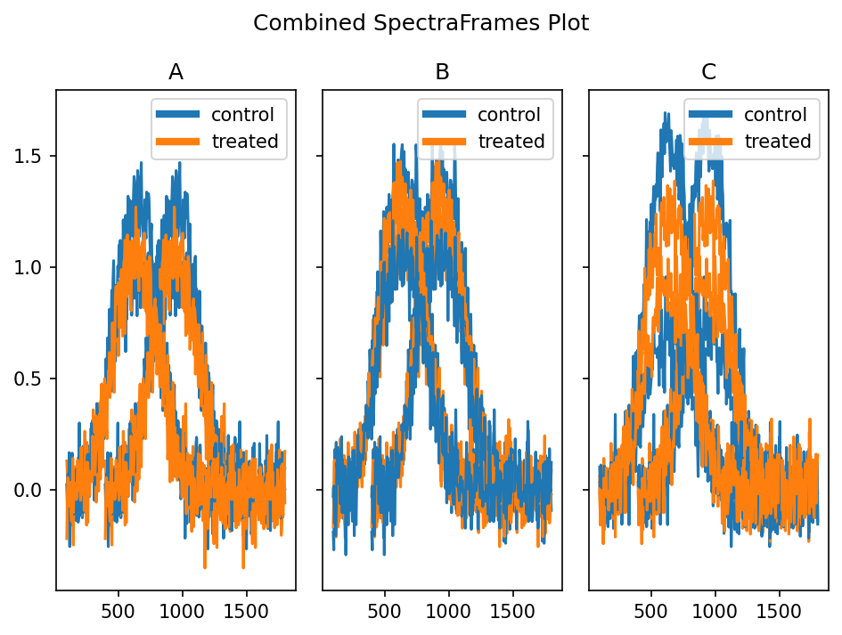
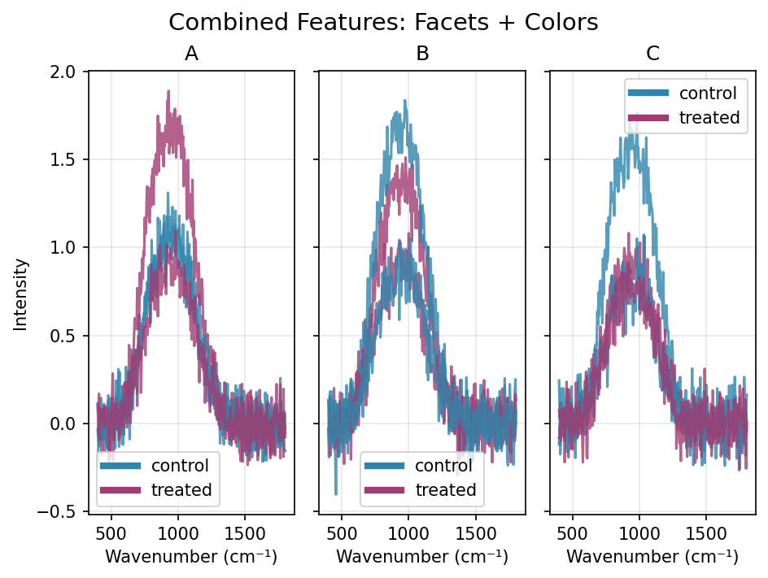

# Visualization

This guide covers the visualization capabilities for plotting spectral data.
The main plotting functionality is provided through the `SpectraFrame.plot()` method, which offers flexible faceted plotting with customizable grouping and coloring options.
The `plot()` method returns a tuple `(fig, axs)`:

- `fig`: matplotlib Figure object
- `axs`: numpy array of matplotlib Axes objects (2D array, even for single plots)

This allows for further customization of individual subplots.

## Basic Plotting

The simplest way to plot spectral data is using the `plot()` method without arguments:

```python
import pyspc
import numpy as np

# Create sample data
wl = np.linspace(400, 800, 100)
spectra = np.random.randn(10, 100)
sf = pyspc.SpectraFrame(spectra, wl=wl)

# Basic plot
fig, axs = sf.plot()
```

{ width="400" }


## Faceted Plotting

Create subplots organized by rows and columns using metadata columns:

```python
import pandas as pd

# Add metadata for grouping
sf.data = pd.DataFrame({
    'sample': [f'S{i:02d}' for i in range(12)],
    'group': ['A', 'B', 'C'] * 4,
    'condition': ['control', 'treated'] * 6,
    'intensity': np.random.uniform(0.5, 2.0, 12),
    'concentration': [1, 2, 3, 4] * 3
})

# Plot by condition (rows) and group (columns)
fig, axs = sf.plot(rows='condition', columns='group')

# Single facet by group
fig, axs = sf.plot(columns='group')
```

{ width="600" }

## Color Grouping

Use the `colors` parameter to group spectra by color:

```python
# Color by group
fig, axs = sf.plot(colors='group')

# Combine faceting with colors
fig, axs = sf.plot(columns='group', colors='condition')
```

{ width="400" }

## Color Palettes

Control the color scheme using the `palette` parameter:

```python
# Use matplotlib colormap
fig, axs = sf.plot(colors='concentration', palette='viridis')

# Use custom color list
custom_colors = ['#FF6B6B', '#4ECDC4', '#45B7D1', '#96CEB4']
fig, axs = sf.plot(colors='concentration', palette=custom_colors)

# Default matplotlib color cycle is used if not specified
fig, axs = sf.plot(colors='group')
```



## Plot Customization

Pass additional matplotlib parameters through `**kwargs`:

```python
# Customize line properties
fig, axs = sf.plot(
    colors='sample',
    alpha=0.7,
    linewidth=2,
    linestyle='--'
)
```
{ width="400" }

```python
# Control subplot sharing
fig, axs = sf.plot(
    columns='group',
    sharex=False,
    sharey=True
)
```
{ width="400" }

```python
# Hide legend
fig, axs = sf.plot(colors='sample', legend=False)
```
{ width="400" }

## Working with Existing Figures

Plot into an existing matplotlib figure:

```python
import matplotlib.pyplot as plt

# Create figure with custom layout
fig, _ = plt.subplots(1, 3, figsize=(10, 8))

# Plot into existing figure
fig, axs = sf.plot(columns='group', fig=fig)

# Further customize
fig.suptitle('Spectral Analysis Results')
plt.tight_layout()
```
{ width="500" }

## Plotting Multiple SpectraFrames

Using existing figures, you can plot multiple `SpectraFrame` objects together:

!!! warning "Use with caution"
    Currently this feature is unstable. Especially, it would not work if different figure layouts are expected. Also, matching legends can be tricky.

```python
sf1 = generate_sample_data()
sf2 = sf1.copy()

# Modify second SpectraFrame to have different metadata
sf2.wl = sf2.wl - 300

    fig, axs = sf1.plot(columns='group', colors='condition')
    fig, axs = sf2.plot(columns='group', colors='condition', fig=fig)
    fig.suptitle('Combined SpectraFrames Plot')
```
{ width="600" }

## Complete Example

Here's a comprehensive example that combines faceting with color grouping:

```python
import pyspc
import numpy as np
import pandas as pd
import matplotlib.pyplot as plt

# Generate sample spectral data
wl = np.linspace(400, 1800, 200)
n_spectra = 12
spectra = np.random.randn(n_spectra, 200)

# Create SpectraFrame with metadata
data = pd.DataFrame({
    'sample': [f'S{i:02d}' for i in range(n_spectra)],
    'group': ['A', 'B', 'C'] * 4,
    'condition': ['control', 'treated'] * 6,
    'intensity': np.random.uniform(0.5, 2.0, n_spectra)
})

sf = pyspc.SpectraFrame(spectra, wl=wl, data=data)

# Create comprehensive plot
fig, axs = sf.plot(
    columns='group', 
    colors='condition',
    palette=['#2E86AB', '#A23B72'],
    alpha=0.8,
    linewidth=1.5
)

# Add labels and title
fig.suptitle('Spectral Data by Group and Condition', fontsize=16)
for ax in axs.flat:
    ax.set_xlabel('Wavenumber (cm⁻¹)')
    ax.set_ylabel('Intensity')

plt.show()
```

{ width="600" }

## Return Values

The `plot()` method returns a tuple `(fig, axs)`:
- `fig`: matplotlib Figure object  
- `axs`: numpy array of matplotlib Axes objects (2D array, even for single plots)

This allows for further customization of individual subplots:

```python
fig, axs = sf.plot(columns='group')

# Customize individual subplots
axs[0, 0].set_title('Group A')
axs[0, 1].set_title('Group B') 
axs[0, 2].set_title('Group C')
for ax in axs.flat:
    ax.grid(True, alpha=0.3)
```

